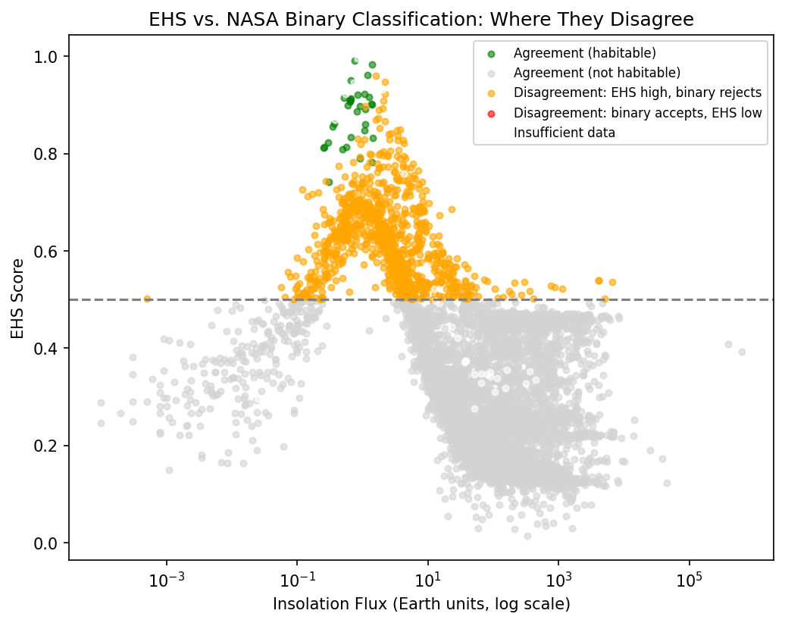

# Exoplanet Habitability Score (EHS)

A 6-factor weighted habitability scoring model for exoplanets — built to critique the
limitations of NASA/PHL's standard binary "potentially habitable" classification, which
relies almost entirely on two factors: stellar flux and planet radius.

This project scores every confirmed exoplanet across **six factors** (flux, temperature,
size, stellar stability, orbital eccentricity, and density), then directly compares those
scores against the standard binary flag to surface planets the simpler method likely
misclassifies.

---

## Key Finding

Comparing EHS against NASA/PHL's standard binary habitability classification across
5,757 confirmed exoplanets: every planet that passes the binary criteria also scores
highly on EHS (no false positives), but **938 planets (16.3%) score highly on EHS
despite failing the binary cutoff**. Of these, 225 fail on insolation flux alone — their
size is plausible, but their flux falls just outside NASA's narrow accepted range. EHS's
gradual scoring treats this as a moderate penalty rather than an automatic
disqualification, suggesting the binary method may be excluding a meaningful number of
plausible candidates.



---

## Why this project exists

Most public habitability checks reduce a planet to "is it the right size, at the right
temperature?" That ignores real, measurable risk factors: a planet can sit in the
"habitable zone" by flux alone and still be a poor candidate if its orbit is wildly
eccentric, its star is an unstable flare-prone M-dwarf, or its bulk density suggests a
gas envelope rather than a rocky surface.

EHS doesn't try to be a definitive habitability classifier — it's a more transparent
alternative to a two-factor cutoff, with every weight and scoring choice documented and
justified rather than hidden inside a model.

---

## Dataset

- **Source:** [NASA Exoplanet Archive](https://exoplanetarchive.ipac.caltech.edu/) —
  Planetary Systems Composite Parameters (PSCompPars) table
- **Pulled via:** direct TAP query (see `notebooks/01_Data_Acquisition.ipynb`)
- **Raw size:** 6,298 confirmed exoplanets, 14 fields per planet
- **Scored size:** 5,757 planets (91.4%) retained after filtering for planets with at
  least 4 of 6 core scoring inputs — see `notes/Session_02.md` for the inclusion
  criteria and rationale
- **Note:** Earth is correctly absent from the raw archive data — this is a
  confirmed-_exoplanet_ archive, not a catalog including the solar system. Earth, Mars,
  and Venus were added manually as reference cases for model validation (Session 6)

---

## Project status

- [x] Data acquisition (NASA Exoplanet Archive, TAP query)
- [x] Data verification (shape, missingness, value-range sanity checks)
- [x] Missingness analysis & inclusion criteria
- [x] Data cleaning & feature engineering (density proxy, stellar stability tiers)
- [x] Scoring model — 6 weighted, normalized factors
- [x] Model validation against reference cases (Earth, Mars, Venus, 51 Pegasi b)
- [x] Critique: EHS vs. NASA/PHL binary classification — found and visualized disagreements
- [x] Interactive Streamlit app (live weight-adjustment "sandbox", radar charts)
- [x] Deployment (Streamlit Community Cloud)

---

## The six factors

| Factor                    | What it captures                                          | Weight |
| ------------------------- | --------------------------------------------------------- | -----: |
| Stellar flux (insolation) | Whether liquid water is physically possible at all        |    25% |
| Equilibrium temperature   | Refines flux with a more direct temperature estimate      |    20% |
| Planet size (radius)      | Rocky vs. gas giant — a hard physical distinction         |    20% |
| Stellar stability         | Flare activity and tidal-locking risk by spectral type    |    15% |
| Density proxy             | Rough signal for whether a rocky composition is plausible |    10% |
| Orbital eccentricity      | Climate volatility from elliptical orbits                 |    10% |

Each factor is normalized to a 0–1 score using non-linear, "peaks at ideal" Gaussian
functions (flux is scored in log-space) rather than simple min-max scaling — the raw
data spans several orders of magnitude and would otherwise distort the scale. A hard
physical disqualifier is also applied: if a planet's radius is wildly inconsistent with
a rocky world, its final score is capped low regardless of other factors (see
`notes/Session_06.md`).

**Known limitation:** the model does not currently include an atmospheric/greenhouse
factor. This means Venus-like planets (Earth-sized, Earth-density, near-circular orbit)
can score highly despite being uninhabitable in reality due to a runaway greenhouse
atmosphere — a limitation rather than an unexamined gap, discussed in
`notes/Session_07.md`.

---

## Tech stack

- **Data:** Pandas, NumPy, astroquery (NASA Exoplanet Archive TAP queries)
- **Modeling:** Hand-built weighted scoring functions — deliberately not a black-box ML
  model, since interpretability is core to the project's pitch
- **Visualization:** Plotly (interactive), Matplotlib (static, for this README)
- **App:** Streamlit _(planned, not yet built)_
- **Dev environment:** Google Antigravity

---

## Repository structure

```
EHS/
├── data/
│   ├── raw_exoplanets.csv
│   ├── filtered_exoplanets.csv
│   ├── clean_exoplanets.csv
│   ├── scored_exoplanets.csv
│   └── scored_exoplanets_partial.csv
├── notebooks/
│   ├── 01_Data_Acquisition.ipynb
│   ├── 02_EDA_Missingness.ipynb
│   ├── 03_Cleaning_Features.ipynb
│   └── 04_Scoring_Model.ipynb
├── notes/
│   ├── Session_01.md  …  Session_09.md
├── assets/
│   └── critique_scatter.png
├── ehs-site/                        # Interactive React + Vite website
│   ├── public/
│   │   └── favicon.svg
│   ├── src/
│   │   ├── components/
│   │   │   ├── Critique.jsx / .css
│   │   │   ├── Dashboard.jsx / .css
│   │   │   ├── Explorer.jsx / .css
│   │   │   ├── Footer.jsx / .css
│   │   │   ├── Formula.jsx / .css
│   │   │   ├── FutureWork.jsx / .css
│   │   │   ├── Hero.jsx / .css
│   │   │   ├── HeroPlanet.jsx
│   │   │   ├── Limitations.jsx / .css
│   │   │   ├── Motivation.jsx / .css
│   │   │   ├── Nav.jsx / .css
│   │   │   ├── ParameterCards.jsx / .css
│   │   │   ├── StarFieldBackground.jsx
│   │   │   └── Timeline.jsx / .css
│   │   ├── data/
│   │   │   └── planets.js
│   │   ├── hooks/
│   │   │   └── useScrollReveal.js
│   │   ├── App.jsx
│   │   ├── main.jsx
│   │   └── index.css
│   ├── index.html
│   ├── package.json
│   └── vite.config.js
├── .gitignore
├── LICENSE
├── README.md
└── requirements.txt
```

---

## Running locally

```bash
git clone https://github.com/Pranees-Yuvaraj/Exoplanet-Habitability-System.git
cd Exoplanet-Habitability-System
pip install -r requirements.txt
jupyter notebook

To run file :
cd ehs-site
npm install
npm run dev
```

Notebooks are numbered in execution order (`01` → `04`); run them sequentially, as each
one loads the CSV output of the previous step.

---

## Future Improvements

- **Atmospheric/greenhouse proxy factor** — would require either better archive
  coverage of atmospheric data, or a derived signal (e.g. from stellar flux × distance ×
  expected greenhouse amplification) as a stand-in
- **Interactive Streamlit app** — live weight-adjustment sandbox, per-planet radar
  charts, and an in-app version of the critique comparison chart
- **Deployment** to Streamlit Community Cloud with a public live demo link

---

## License

MIT
